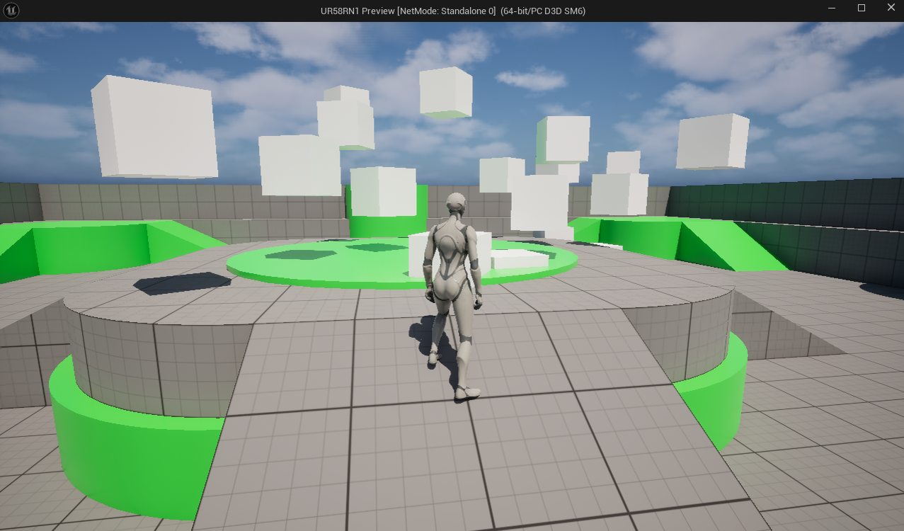

# Example project to show how to add ReplicaNet to Unreal

In VisualStudio solution view, to save time opening the solution, unload the projects in: Engine, Programs

## Run the demo
Run the ReplicaNet game server: UR58RN1\ReplicaNetServer\ReplicaNetServer.slnx
Open the Unreal project: UR58RN1.uproject
Start a game.
You should see the MyActorTest instances move, these get their movement from the ReplicaNet server, they are not moved by Unreal replication.

## Game server
The server uses UR58RN1\ReplicaNetServer\ReplicaNetServer\ReplicaNetServer.cpp to create a session with SessionCreate()\
It creates instances of the Plane class which automatically replicates position and orientation.\
The ROL file UR58RN1\Source\UR58RN1\ReplicaNetGlue\_RO_Plane.rol defines how the class members are replicated. This is compiled with the RNROLCompiler which generates _RO_*.cpp/h files.\
The ROL file UR58RN1\Source\UR58RN1\ReplicaNetGlue\_Def_Example1.rol defines which replicated objects are included.

## Game clients
The Unreal project UR58RN1\UR58RN1.uproject has instances of MyActorTest class with attached static cube mesh. There is no Unreal replication for this class.\
When the project runs it first tries to attach to a ReplicaNet session using "UR58RN1\Source\UR58RN1\ReplicaNetGlue\GameObject.cpp" and SessionJoin().\
Next, instances of "UR58RN1\Source\UR58RN1\MyActorTest.cpp" will try to attach to any network replicated instances of the Plane class using FindUnownedGameObject(). The position and rotation are then read from the attached Plane class and set with SetActorLocationAndRotation().\
Even an Unreal server instance is effectively a client of the ReplicaNet based server.\
UMyGameInstance::OnStart() is used to ensure consistent existing object ID mapping to network object mapping.

To enable the distance based object propagation, which considerably improves network bandwidth, each AUR58RN1Character (ACharacter) that IsLocallyControlled will create a Camera network object.\
This invisible object is registered as an observer (SetObserver) of the local session, this communicates the approximate player view position to the server.\
Basically, objects closer to a player's observer position will send more accurate updates, and objects further away will send fewer less accurate updates.\
The object distance calculation is enabled with CALCULATE_DISTANCE, which implements the callback CalculateDistanceToObject.
